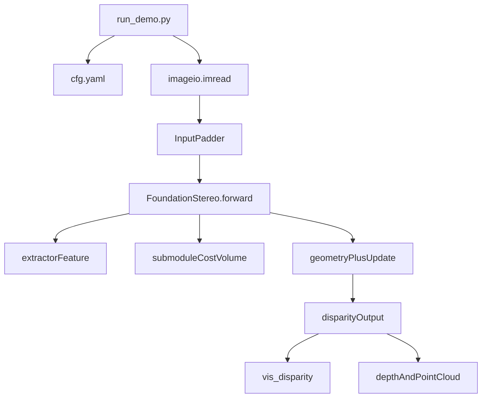

# FoundationStereo 学习计划

## 学习目标

- 2 周内完成：能独立跑通单图/批量推理、解释核心前向流程、做一个小改动并验证输出。
- 重点放在“立体推理链路 + 部署导出”，不把时间花在仓库中缺失的训练实现上。

## 项目认知（先知道全貌）

- 这是一个以推理和部署为主的项目：入口在脚本目录，核心模型在 `core`。
- 训练相关（stereo loss、stereo dataloader、训练启动脚本）不在本仓库，避免按“从零训练”思路学习。
- 先读文档和入口脚本，再深入模型内部。

## 推荐阅读顺序（按优先级）

- [readme.md](/home/zhouchao/learn/nvidia/FoundationStereo/readme.md)
- [environment.yml](/home/zhouchao/learn/nvidia/FoundationStereo/environment.yml)
- [scripts/run_demo.py](/home/zhouchao/learn/nvidia/FoundationStereo/scripts/run_demo.py)
- [core/foundation_stereo.py](/home/zhouchao/learn/nvidia/FoundationStereo/core/foundation_stereo.py)
- [core/extractor.py](/home/zhouchao/learn/nvidia/FoundationStereo/core/extractor.py)
- [core/submodule.py](/home/zhouchao/learn/nvidia/FoundationStereo/core/submodule.py)
- [core/update.py](/home/zhouchao/learn/nvidia/FoundationStereo/core/update.py)
- [core/geometry.py](/home/zhouchao/learn/nvidia/FoundationStereo/core/geometry.py)
- [core/utils/utils.py](/home/zhouchao/learn/nvidia/FoundationStereo/core/utils/utils.py)
- [Utils.py](/home/zhouchao/learn/nvidia/FoundationStereo/Utils.py)
- [scripts/run_demo_batch.py](/home/zhouchao/learn/nvidia/FoundationStereo/scripts/run_demo_batch.py)
- [scripts/make_onnx.py](/home/zhouchao/learn/nvidia/FoundationStereo/scripts/make_onnx.py)

## 两周分阶段路线

### 第 1 阶段（第 1-2 天）：跑通与定位

- 按 [readme.md](/home/zhouchao/learn/nvidia/FoundationStereo/readme.md) 和 [environment.yml](/home/zhouchao/learn/nvidia/FoundationStereo/environment.yml) 完成环境。
- 跑通 [scripts/run_demo.py](/home/zhouchao/learn/nvidia/FoundationStereo/scripts/run_demo.py)，产出 `vis.png`（可选 `cloud.ply`）。
- 验收：你能解释清楚命令行参数 `left_file/right_file/ckpt_dir/out_dir/scale/get_pc` 的作用。

### 第 2 阶段（第 3-5 天）：主推理链路吃透

- 从 [scripts/run_demo.py](/home/zhouchao/learn/nvidia/FoundationStereo/scripts/run_demo.py) 追到 [core/foundation_stereo.py](/home/zhouchao/learn/nvidia/FoundationStereo/core/foundation_stereo.py) 的 `forward`。
- 重点理解 4 个点：
  - 输入预处理：`InputPadder` 与图像归一化。
  - 特征提取：`extractor` 分支。
  - 代价体与初始视差：`submodule` 相关函数。
  - 迭代更新：`update` + `geometry` 的协同。
- 验收：你可以画出“输入到视差输出”的函数调用链，并说明 `iters` 增大时会发生什么。

### 第 3 阶段（第 6-8 天）：数据与结果表达

- 阅读 [scripts/run_demo_batch.py](/home/zhouchao/learn/nvidia/FoundationStereo/scripts/run_demo_batch.py) 了解批量推理和 metadata 对接方式。
- 阅读 [Utils.py](/home/zhouchao/learn/nvidia/FoundationStereo/Utils.py) 与 [scripts/vis_dataset.py](/home/zhouchao/learn/nvidia/FoundationStereo/scripts/vis_dataset.py) 了解视差可视化、深度/点云导出。
- 验收：你能说明“视差 -> 深度 -> 点云”的参数依赖（内参、基线、无效值处理）。

### 第 4 阶段（第 9-11 天）：部署链路（可选但推荐）

- 阅读并运行 [scripts/make_onnx.py](/home/zhouchao/learn/nvidia/FoundationStereo/scripts/make_onnx.py)，理解导出约束（输入尺寸、`valid_iters` 固定）。
- 对照 readme 中 TRT 流程，理解 ONNX 到 TensorRT 的接口假设。
- 验收：你能说清 PyTorch 推理与 ONNX/TRT 推理的输入输出一致性要求。

### 第 5 阶段（第 12-14 天）：最小改动验证理解

- 做一个“小改动实验”（三选一）：
  - 修改 `valid_iters`，观察质量/速度变化。
  - 修改 `scale`，观察细节与性能权衡。
  - 对比是否启用点云导出，确认几何参数影响。
- 记录实验：输入、参数、输出现象、结论各 1-2 句。
- 验收：你能给出“哪个参数最影响你的业务场景”的判断依据。

## 学习主链路图

## 常见误区（学习时优先规避）

- 误区 1：把它当完整训练仓库；实际上这里主要是推理与部署。
- 误区 2：只拷 `.pth` 不拷同目录 `cfg.yaml`。
- 误区 3：忽略输入必须成对且校正良好（左右相机顺序不能错）。
- 误区 4：忽略 padding 与尺寸约束，导致结果或速度异常。

## 你的产出模板（每天 5 分钟）

- 今天读了哪些文件（2-4 个路径）。
- 新理解了哪条调用链（1 条）。
- 卡住的点（最多 2 条）。
- 明天要验证的 1 个实验。

